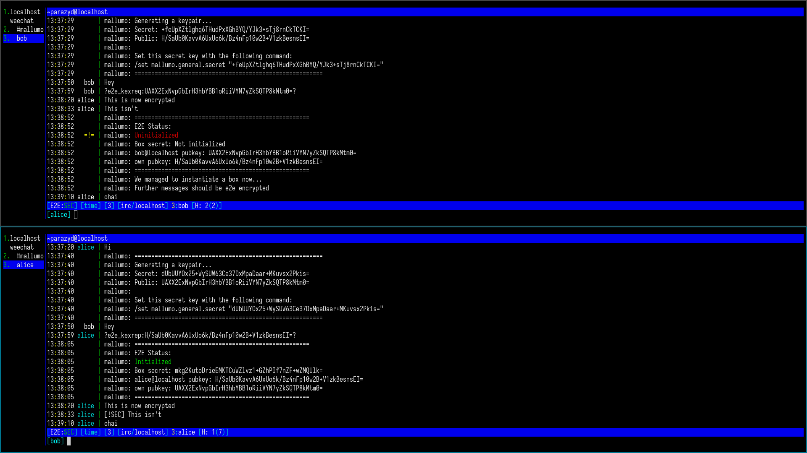

mallumo
=======

e2e encryption in weechat using libsodium.



## Dependencies

* `python-3.8` or newer.
* [`pynacl`](https://github.com/pyca/pynacl/)

N.B. I have only tested this on python3.10, but it should work with
others too.

## Installation

First clone the repo and symlink the python module into your weechat
autoload directory:

```shell
$ git clone https://github.com/darkrenaissance/mallumo
$ cd ~/.weechat/python
$ ln -s /path/to/mallumo/mallumo/ # Note this is the inner mallumo dir
$ ln -s $(realpath mallumo/__init__.py) autoload/mallumo.py
```

With this method, you can receive updates seamlessly, just by issuing
`git pull`.


## Usage

In weechat:

```
/help mallumo

[python/mallumo]  /mallumo  gen
                            kex
                            reset
                            status
                            enable
                            disable


E2E encryption for private IRC messages

Quick start:

Add an E2E item to the status bar by adding '[mallumo]' to the config setting
weechat.bar.status.items. This will show if your current chat is encrypted.

Usage:
/mallumo gen          [ generate a new keypair ]
/mallumo kex          [ initiate an e2e encrypted session ]
/mallumo reset [-f]   [ unset the public key associated to the current buffer ]
/mallumo status       [ show and possibly initialize a session ]
/mallumo disable      [ disable encryption for current buffer ]
/mallumo enable       [ enable encryption for current buffer ]
```

Before exiting, do run `/save` in order to make sure keep any pubkeys
you have exchanged.

## Protocol

Basic NaCl box, no ephemeral keys, persistent sessions.

```python
from base64 import b64encode, b64decode
from nacl.public import PublicKey, PrivateKey, Box

alice = PrivateKey.generate()
alice_sessions = {}

bob = PrivateKey.generate()
bob_sessions = {}

# Key exchange
alice_pub = f"{b64encode(alice.public_key.encode()).decode()}"
bob_pub = f"{b64encode(bob.public_key.encode()).decode()}"

send_to_bob(f"?e2e_kexreq:{alice_pub}?")

msg = bob.recv()
alice_pub = decode_kexeq(msg)
send_to_alice(f"?e2e_kexrep:{bob_pub}?")

bob_sessions["alice"] = Box(bob, alice_pub)

msg = alice.recv()
bob_pub = decode_kexrep(msg)
alice_sessions["bob"] = Box(alice, bob_pub)

enc_msg = alice_sessions["bob"].encrypt("foo")
send_to_bob(f"?e2e_msg:WW91IGJhc3RhcmQgbG1hby4gQnV5IHRoZSBkaXAhCg==?")
```


## License

GNU GPL version 3
